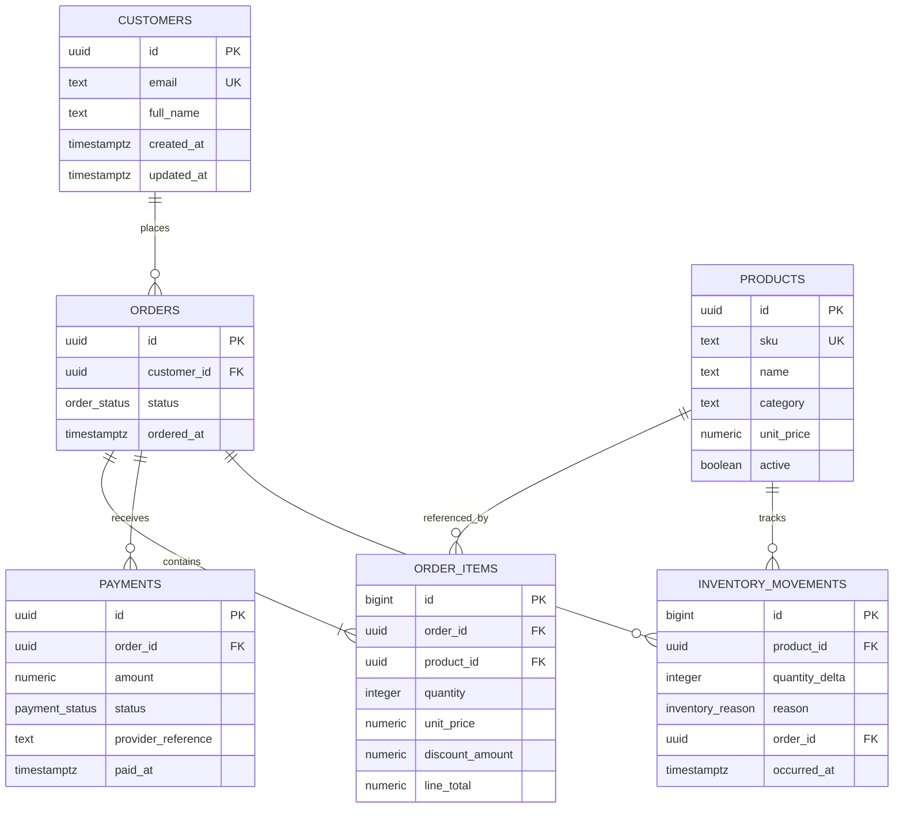

# CommerceLedger Entity Relationship Diagram

## Design approach

CommerceLedger separates transactional entities from derived reporting objects.

The inventory model uses an **append-only ledger** rather than a mutable stock column. Current stock is derived from `SUM(quantity_delta)`, which makes every change auditable and enables running-balance queries.

Order prices are snapshotted in `order_items.unit_price`. This means historical order totals remain stable even when a product's current price changes.

The API-independent business layer lives inside PostgreSQL through stored functions:

- `create_order()` validates stock and reserves inventory transactionally.
- `record_payment()` records successful payments and promotes fully paid orders.
- `cancel_order()` creates compensating inventory movements rather than rewriting history.
- triggers enforce legal order-state transitions and inventory immutability.

Reporting is exposed through normal views and a materialized daily-sales view so the project demonstrates both transactional and analytical PostgreSQL patterns.
